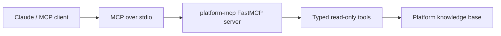

# platform-mcp

[](https://github.com/SriLingala/platform-mcp/actions/workflows/ci.yml)
[](https://www.python.org/)
[](LICENSE)

A Model Context Protocol (MCP) server that exposes platform engineering
knowledge as tools Claude can call directly. Built on the official MCP Python
SDK.

The server demonstrates how a platform team can give AI assistants safe,
auditable, scoped access to internal knowledge: design patterns, runbooks,
compliance checks and blueprint metadata.

## Why this exists

Engineering teams increasingly use Claude Code, Claude Desktop and other AI
assistants for day-to-day work. The default behaviour is to dump everything
into context. That is slow, expensive and leaks information you may not want
in the model context window.

MCP solves this by letting the assistant call typed tools backed by your own
servers. The assistant only sees what the tool returns. The platform team
controls what is exposed, how, and with what authorisation.

This server is a working starting point for that pattern.

## Architecture



## What it exposes

Five tools, all read-only. Every call is logged at INFO to stderr with the
tool name and args, so the audit pitch below has real code behind it.

| Tool                | Purpose                                                      |
|---------------------|--------------------------------------------------------------|
| `list_blueprints`   | List the platform reference blueprints in this organisation. |
| `describe_blueprint`| Return the full description of a named blueprint.            |
| `describe_pattern`  | Explain a platform design pattern (e.g. workload identity).  |
| `get_runbook`       | Return runbook steps for a common incident scenario.         |
| `check_compliance`  | Return the compliance check matrix for a platform component. |

Enum-shaped args (`pattern`, `scenario`, `component`, blueprint `name`) are
typed with `Literal[...]` so the MCP tool schema advertises the valid values
to the assistant up front. Unknown inputs raise `ValueError`, which FastMCP
surfaces to the client as a proper MCP error instead of a string the
assistant might mistake for data.

## Run it locally

```bash
python -m venv .venv && source .venv/bin/activate
pip install -e .
platform-mcp                # or: python platform_mcp/server.py
```

The server speaks MCP over stdio. Wire it into Claude Desktop / Claude Code by
copying one of these examples into your client config:

- [docs/claude_desktop_config.json](docs/claude_desktop_config.json) if you
  installed the package with `pip install -e .`.
- [docs/claude_desktop_config.python.json](docs/claude_desktop_config.python.json)
  if you prefer to launch the Python script directly.

The config path varies by OS; see the
[MCP quickstart](https://modelcontextprotocol.io/quickstart). Use absolute
paths in the `command` and `args` fields.

Open the client. Ask "what platform blueprints are available?" The assistant
will call `list_blueprints` and answer from the returned data.

## Example prompts

Try these after the server is connected:

- "What platform blueprints are available?"
- "Describe the AKS platform blueprint."
- "Explain the workload identity pattern for a platform team."
- "Give me the runbook for an Argo CD app that is out of sync."
- "What compliance checks should I run for a container image?"

## Development

```bash
pip install -e ".[dev]"
ruff check .
pytest
```

CI runs the same checks against Python 3.10 / 3.11 / 3.12 / 3.13 on every
push and pull request; see
[.github/workflows/ci.yml](.github/workflows/ci.yml).

## Adding a new tool

1. Add the backing data or provider function.
2. Define a narrow `Literal[...]` input type when the allowed values are known.
3. Decorate the function with `@mcp.tool()`.
4. Call `_audit(...)` at the top of the tool function.
5. Add tests for the successful response shape and invalid input path.

## Extending it

The knowledge base is in-memory Python dictionaries for the demo. In a real
deployment you would back it with:

- **Git** for blueprint metadata. Read a YAML manifest from each repo.
- **Confluence or Notion** for runbooks. Authenticated read-only API calls.
- **Postgres / vector store** for free-text knowledge. RAG over historical
  incident notes.
- **OPA Gatekeeper / Sentinel** for compliance state. Live query of the
  policy engine.

The tool surface stays small and typed. The backing data can be as rich as
your platform requires.

## Why an MCP server for a platform team

Three concrete wins worth calling out:

1. **Auditable AI assistance.** Every tool call is logged. You know exactly
   what context Claude saw and which platform engineer triggered it.
2. **Permissioned access.** The MCP server runs as a known service identity.
   You can scope what it reads. Claude inherits only what the server allows.
3. **Composable.** Multiple MCP servers per workflow. A "platform" server, a
   "git" server, an "incident" server. The assistant orchestrates them.
